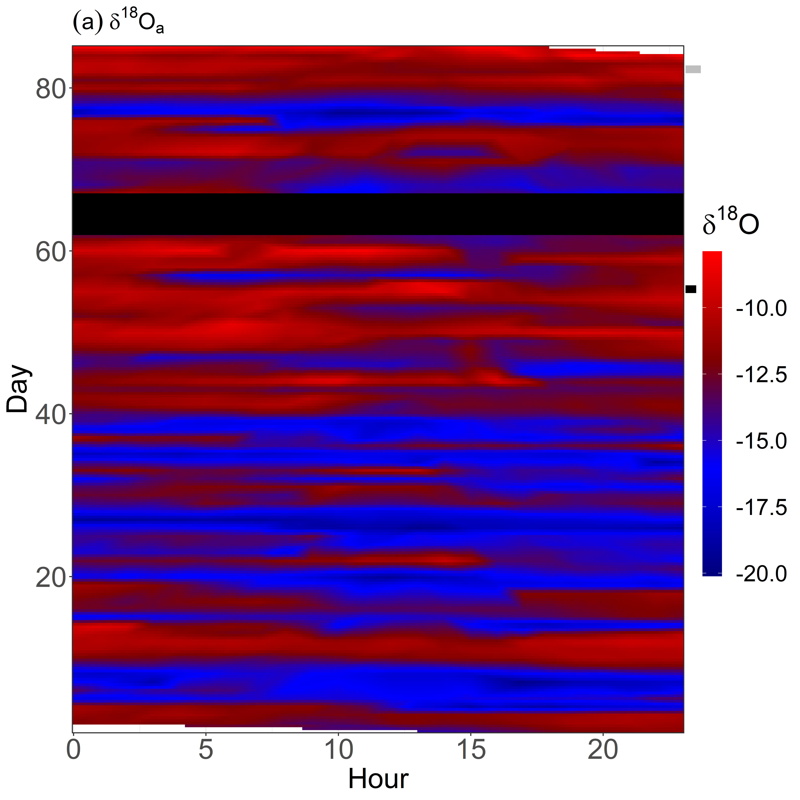
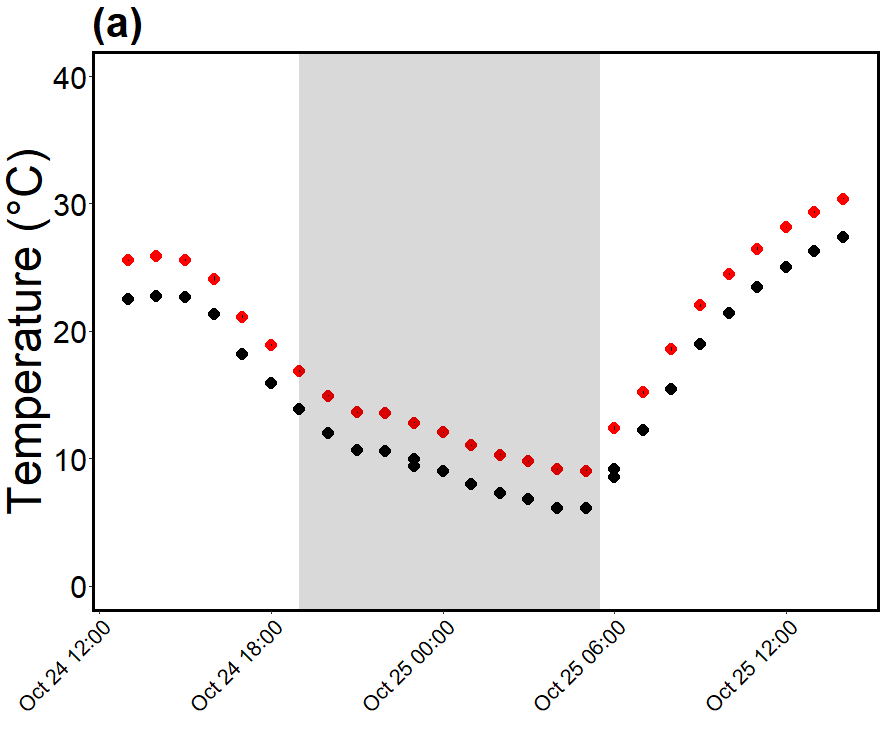

# Isotopic steady state or non-steady state? Insights from whole tree transpiration

## This read me will document the analysis of a whole tree chamber expirment that used stable isotopes to investigate the isotopic composotion of tree transpiration.

There are a number of .CSVs hosted on google drive - the R scripts will download them automatically. To recreate the analysis internet is needed. 

Figure 2
Figure 2 plots the the isotope composition, air temperature and VPD of the atmosphere, and ambient and eleveted chambers. To do this I interpolated between data points.
The readme will show one example (Figure 2, Panel A) the "Figure 2.R" file will recreate teh whole plot
## Steps
Load Packages
```r
library(lubridate);library(ggplot2);library(xts);library(dplyr);library(grid);library(cowplot)
library(plantecophys);library(akima);library(doBy);library(reshape2);library(gdata);library(ggpubr);
library(data.table);library(rmarkdown);library(tinytex);library(knitr)
```
Load isotope data
```r
googledriveWTC4ISOTOPEID <- "1RNzYApcCO1D1sr_mVQgQVSQFIWNWlqVm"
df<- read.csv(sprintf("https://docs.google.com/uc?id=%s&export=download", googledriveWTC4ISOTOPEID))
```
Next I define "Time" and then create colums that are days and hours
```r
df["Td"]<-(dmy_hm(df$stime, quiet=TRUE, tz="UTC"));summary(df$Td)
df$date <- as.Date(df$Td, format = "%Y-%m-%d") ; summary(df$date); str(df$date)
df["month"]<-format(df$Td,"%m");str(df$month)
df$hm <- format(df$Td, "%H") ; summary(df$hm)
df["week"]<-strftime(df$Td,format="%W",tz="UTC");str(df$week)
```
Next I trim the data to the relevent timeframe
```r
start<-ymd_hms("2016-08-28 12:00:00 UTC");summary(start)
end<-ymd_hms("2016-11-26 12:00:00")
int<-interval(start, end); summary(int)
df<-subset(df, df$Td %within% int);head(df$Td);tail(df$Td)
```
Next I trim a few outliers
```r
df<-subset(df, df$d18O.corrected <= -8)
df<-subset(df, df$d18O.corrected >= -20)
```
Then I create a trimmed data frame with relevent columns 
```r
dftrt<-data.frame(df$hm, df$month, df$d18O.corrected, df$T_treatment, df$Td);str(dftrt)
```
Then I calculate treatment means (+ 3C, Ambient and Atmosphereic)
```r
dft<-dftrt %>% group_by(df.T_treatment, df.Td) %>% summarise_at(.vars = names(.)[3:3], na.rm=TRUE, .funs = c(mean))
```
Because panel a is the atmopshere I subset the atmopshere data 
```r
dft<-subset(dft,df.T_treatment == "atm") #Only take atmosphere data
```
The time class is lost in the averaging we we assign time structure 
```r
dft$date <- as.Date(dft$df.Td, format = "%Y-%m-%d") 
dft["month"]<-format(dft$df.Td,"%m");str(dft$month)
dft["monthday"]<-format(dft$df.Td,"%m%d");str(dft$monthday)
dft<-transform(dft,day=as.numeric(factor(monthday))) #day
dft<-as.data.frame(dft)
dft$hm <- format(dft$df.Td, "%H") 
```
I then create a subset again with hour, day and isotope data
```r
dfsml<-data.frame(dft$hm, dft$day, dft$df.d18O.corrected) 
```
The next step is to prepare for interpolataion   
```r
colnames(dfsml)<-c("x", "y","z") ; str(dfsml)
dfsml$x<-as.numeric(paste(dfsml$x))
dfsml$y<-as.numeric(paste(dfsml$y));str(dfsml)
x<-as.numeric(paste(dfsml$x))
y<-as.numeric(paste(dfsml$y))
z<-dfsml$z
sample=as.data.frame(cbind(x,y,z))
names(sample) <- c("d", "m", "value")
```
and then to interpolate
```r
d1 <- with(sample, interp(x = d, y = m, z = value, nx = 250, ny=250, duplicate = "mean", extrap=FALSE))
```
I then make the data 3 colums
```r
d2 <- melt(d1$z, na.rm = TRUE)
```
and prepare to plot
```r
names(d2) <- c("x", "y", "z")
d2$d<- d1$x[d2$x]
d2$m <- d1$y[d2$y]
```
Fristly I define a blue to red color map

```r
br=colorRampPalette(colors = c("#00007F","blue","#7F0000","red"))
```
and define some labels that will highlight the intensive campaigns 

```r
c1 <- textGrob("-", gp=gpar(fontsize=50, fontface="bold", col="black"))
c2<- textGrob("-", gp=gpar(fontsize=50, fontface="bold", col="grey"))
```
I use "ggplot" to plot

```r
ggplot(data = d2, aes(x = d, y = m, fill = z, z = z)) + 
  geom_tile()+  
  scale_fill_gradientn(colours = br(1000), limits =c(-20,-8))+
  labs(x="Hour", y="Day")+
  labs(fill=bquote(delta^18*O))+
  ggtitle(bquote((a)~delta^18*O[a]))+
  theme_bw()+
  theme(text = element_text(size=25))+
  theme(axis.text=element_text(size=25))+ 
  theme(legend.position='right') +
  scale_x_continuous(expand=c(0,0)) + 
  scale_y_continuous(expand=c(0,0))+
  annotate("rect", xmin = -Inf, xmax = Inf, ymin = 62, ymax = 67, alpha = 1,
           colour="black",fill="black")+
  guides(fill=guide_colourbar(barwdith=0.5, barheight =20, nbin=50)) +
  theme(plot.title = element_text(size = 20, face = "bold"))+
  annotation_custom(c1, xmin=23.7, xmax=23,ymin=55.5, ymax=56.5) +
  annotation_custom(c2, xmin=23.7, xmax=23,ymin=82.5, ymax=83.5) 
  ```
  Finally, here is what the code produces. The other panels just involve changing treatment (eg ambient of elevated) or variable (eg Temperature or VPD)
 
  

# Figure 3
The next figure uses campaign data. Firstly I calculate the 18O of transpiration via mass balance along with some other calculations- all scripts use the same packages.

Load the campaign data 
```r
googledriveWTC4ISOTOPEIDCAMPAIGNDATA <- "1_K_m1eq-iQGQmOC3hqoI7_8qxVve3YoB"
df<- read.csv(sprintf("https://docs.google.com/uc?id=%s&export=download", googledriveWTC4ISOTOPEIDCAMPAIGNDATA))
```
define source water 
```r
df["source"]=-3.28 ##from branch water
```
Next I define chamber terms to match WTC notation 
```r
F=df$Fwat_mean #F is the flow of water vapour into the chamber (mol s-1), 
V=df$Vwat_mean #V is the venting of water vapour out of the chamber (mol s-1), 
C=df$CONDH2O_mean #C is the rate of water removal from the chamber air by the condenser (mol s-1); 
S=df$deltaH2O_mean #S is the change in storage of water vapour in the chamber air from one time step to the next (mol s-1).
```
To calculate the mass balance we need to get the previous observation to create a storage term
```r
df=mutate(df, d18O.corrected_WV_PREVIOUS = lag(d18O.corrected_WV) )
df=mutate(df, HWTCPREVIOUS = lag(HWTC_mean) )
```
The initial campaign data frame didnt have data before the first condensed water observation. Not the most effecient way to do things but I add these values in manually 

```r
df$d18O.corrected_WV_PREVIOUS[df$Tdh=="24/10/2016 13:00" & df$chamber=="C01"]<- -12.71529536
df$d18O.corrected_WV_PREVIOUS[df$Tdh=="24/10/2016 13:00" & df$chamber=="C02"]<--12.5988649
df$d18O.corrected_WV_PREVIOUS[df$Tdh=="24/10/2016 13:00" & df$chamber=="C03"]<--12.58412318
df$d18O.corrected_WV_PREVIOUS[df$Tdh=="24/10/2016 13:00" & df$chamber=="C04"]<--11.9876596
df$d18O.corrected_WV_PREVIOUS[df$Tdh=="24/10/2016 13:00" & df$chamber=="C05"]<--12.10632715
df$d18O.corrected_WV_PREVIOUS[df$Tdh=="24/10/2016 13:00" & df$chamber=="C06"]<--11.94211656
df$d18O.corrected_WV_PREVIOUS[df$Tdh=="24/10/2016 13:00" & df$chamber=="C07"]<--12.34622914
df$d18O.corrected_WV_PREVIOUS[df$Tdh=="24/10/2016 13:00" & df$chamber=="C08"]<--12.39703311
df$d18O.corrected_WV_PREVIOUS[df$Tdh=="24/10/2016 13:00" & df$chamber=="C09"]<--12.26416026
df$d18O.corrected_WV_PREVIOUS[df$Tdh=="24/10/2016 13:00" & df$chamber=="C010"]<- -12.2405457
df$d18O.corrected_WV_PREVIOUS[df$Tdh=="24/10/2016 13:00" & df$chamber=="C011"]<-  -12.46127815
df$d18O.corrected_WV_PREVIOUS[df$Tdh=="24/10/2016 13:00" & df$chamber=="C012"]<-  -12.39354702

df$d18O.corrected_WV_PREVIOUS[df$Tdh=="20/11/2016 12:00" & df$chamber=="C01"]<- -13.58086623
df$d18O.corrected_WV_PREVIOUS[df$Tdh=="20/11/2016 12:00" & df$chamber=="C02"]<--12.94873974
df$d18O.corrected_WV_PREVIOUS[df$Tdh=="20/11/2016 12:00" & df$chamber=="C03"]<--13.99566358
df$d18O.corrected_WV_PREVIOUS[df$Tdh=="20/11/2016 12:00" & df$chamber=="C04"]<--13.44062848
df$d18O.corrected_WV_PREVIOUS[df$Tdh=="20/11/2016 12:00" & df$chamber=="C05"]<--14.33404636
df$d18O.corrected_WV_PREVIOUS[df$Tdh=="20/11/2016 12:00" & df$chamber=="C06"]<--12.82402649
df$d18O.corrected_WV_PREVIOUS[df$Tdh=="20/11/2016 12:00" & df$chamber=="C07"]<--13.82670464
df$d18O.corrected_WV_PREVIOUS[df$Tdh=="20/11/2016 12:00" & df$chamber=="C08"]<--13.04301391
df$d18O.corrected_WV_PREVIOUS[df$Tdh=="20/11/2016 12:00" & df$chamber=="C09"]<--14.19239735
df$d18O.corrected_WV_PREVIOUS[df$Tdh=="20/11/2016 12:00" & df$chamber=="C010"]<- -11.79007219
df$d18O.corrected_WV_PREVIOUS[df$Tdh=="20/11/2016 12:00" & df$chamber=="C011"]<-  -14.09134636
df$d18O.corrected_WV_PREVIOUS[df$Tdh=="20/11/2016 12:00" & df$chamber=="C012"]<-  -12.73815232

df$HWTCPREVIOUS[df$Tdh=="24/10/2016 13:00" & df$chamber=="C01"]<- 2088.881441
df$HWTCPREVIOUS[df$Tdh=="24/10/2016 13:00" & df$chamber=="C02"]<-2473.286808
df$HWTCPREVIOUS[df$Tdh=="24/10/2016 13:00" & df$chamber=="C03"]<-2089.415438
df$HWTCPREVIOUS[df$Tdh=="24/10/2016 13:00" & df$chamber=="C04"]<-2504.145883
df$HWTCPREVIOUS[df$Tdh=="24/10/2016 13:00" & df$chamber=="C05"]<-2085.775293
df$HWTCPREVIOUS[df$Tdh=="24/10/2016 13:00" & df$chamber=="C06"]<-2451.11
df$HWTCPREVIOUS[df$Tdh=="24/10/2016 13:00" & df$chamber=="C07"]<-2071.409
df$HWTCPREVIOUS[df$Tdh=="24/10/2016 13:00" & df$chamber=="C08"]<-2492.445
df$HWTCPREVIOUS[df$Tdh=="24/10/2016 13:00" & df$chamber=="C09"]<-2074.763
df$HWTCPREVIOUS[df$Tdh=="24/10/2016 13:00" & df$chamber=="C010"]<- 2464.934
df$HWTCPREVIOUS[df$Tdh=="24/10/2016 13:00" & df$chamber=="C011"]<-  2059.148
df$HWTCPREVIOUS[df$Tdh=="24/10/2016 13:00" & df$chamber=="C012"]<- 2477.758

df$HWTCPREVIOUS[df$Tdh=="20/11/2016 12:00" & df$chamber=="C01"]<- 1354.630277
df$HWTCPREVIOUS[df$Tdh=="20/11/2016 12:00" & df$chamber=="C02"]<-1619.886557
df$HWTCPREVIOUS[df$Tdh=="20/11/2016 12:00" & df$chamber=="C03"]<-1365.072288
df$HWTCPREVIOUS[df$Tdh=="20/11/2016 12:00" & df$chamber=="C04"]<-1622.288884
df$HWTCPREVIOUS[df$Tdh=="20/11/2016 12:00" & df$chamber=="C05"]<-1283.044575
df$HWTCPREVIOUS[df$Tdh=="20/11/2016 12:00" & df$chamber=="C06"]<-1611.162
df$HWTCPREVIOUS[df$Tdh=="20/11/2016 12:00" & df$chamber=="C07"]<-1336.095
df$HWTCPREVIOUS[df$Tdh=="20/11/2016 12:00" & df$chamber=="C08"]<-1767.785
df$HWTCPREVIOUS[df$Tdh=="20/11/2016 12:00" & df$chamber=="C09"]<-1322.821
df$HWTCPREVIOUS[df$Tdh=="20/11/2016 12:00" & df$chamber=="C010"]<- 1609.709
df$HWTCPREVIOUS[df$Tdh=="20/11/2016 12:00" & df$chamber=="C011"]<- 1284.557
df$HWTCPREVIOUS[df$Tdh=="20/11/2016 12:00" & df$chamber=="C012"]<-  1767.97
```
I can calculate the isotopic storage term
```
dwtc=df$d18O.corrected_WV
dwtc1=df$d18O.corrected_WV_PREVIOUS
wt1=df$HWTCPREVIOUS
deltas=((wt*dwtc)-(wt1*dwtc1))/(wt-wt1)
```
and the H2O storage term 
```r
Scalculated=(((wt-wt1)/(Chamberpressure*1000))*(Chambervolume/22.4))*(1/3600)
```
and then transpiration 
```r
E=V-F+C+Scalculated
df$E=E
```
the next step is to calculate delata E

```r
c=df$CONDH2O_mean
deltav=df$d18O.corrected_WV
deltaf=df$d18O.corrected_WV.AMB.
deltac=df$d18O.corrected_Cond 
de=((V*deltav)-(F*deltaf)+(C*deltac)+(Scalculated*deltas))/E
df$dtrans=de
```
To better understand what the trees are doing some variables are better expressed on per leaf area basis 

```
df$leafarea[df$chamber=="C01"]<-23.62101328 #M^2
df$leafarea[df$chamber=="C02"]<- 17.17025483
df$leafarea[df$chamber=="C03"]<- 12.37672299
df$leafarea[df$chamber=="C04"]<-24.62392584
df$leafarea[df$chamber=="C05"]<- 12.92316481
df$leafarea[df$chamber=="C06"]<-29.71035506
df$leafarea[df$chamber=="C07"]<- 14.61233375
df$leafarea[df$chamber=="C08"]<- 24.42841037
df$leafarea[df$chamber=="C09"]<- 17.33770004
df$leafarea[df$chamber=="C10"]<- 17.13905693
df$leafarea[df$chamber=="C11"]<- 9.63132978
df$leafarea[df$chamber=="C12"]<- 27.27409398
df$LACM<-df$leafarea / 10000
```
Next I calculate the mole fraction of water vapour in the leaf 
```r
mole fraction of water vapor within the leaf, mmol H2O mol air-1.
```
and the leaf intercellular vapour concentration (mol water vapour/mol moist air)
```r
df$wi<-df$Ei / df$AIRPRESS_mean/10  #mol mol -1
```
Transpiration (E) is then expressed relative to leaf area 
```r
df$Emmol<-df$E*1000 #go to mmol
df$Eleaf<-df$Emmol/df$leafarea ; plot(df$Eleaf) #(mmol H2O m-2 s-1)
```
Then using the plant ecophys package VPD is calculated 
```r
df$esat<-esat(TdegC=df$Tair_al_mean, Pa = 101)
df$vpd<-RHtoVPD(RH=df$RH_al_mean, TdegC=df$Tair_al_mean, Pa = 101) ; plot(df$vpd);summary(df$vpd)
```
Then I calculate gt -gt is total conductance to water vapour through the stomata and leaf boundary layer
```r
df$gs<-df$Eleaf/df$vpd/10 # mol
```
Next I calculate leaf water turonover time 
```r
##Calculate Leaf Water Residence Times##
df$W<- 12 #mol m-2
df$t<-df$W/(df$gs*df$wi) # in seconds
df$tm<-df$t/60 ;mean(df$tm, na.rm=TRUE);min(df$tm, na.rm=TRUE);max(df$tm, na.rm=TRUE) # T in mins
df$th<-df$t/3600 ;mean(df$th, na.rm=TRUE);min(df$th, na.rm=TRUE);max(df$th, na.rm=TRUE) # T in hour
###Calculate for isotopes
df$ek=0.027
df$alphak<-1+df$ek
df["Eplus"]<-2.644-(3.206*((10^3)/(df$Tair_al_mean+273.16)))+(1.534*((10^6)/((df$Tair_al_mean+273.16)^2)))
df$betaplus<-(df$Eplus/1000)+ 1
mean(df$alphak*df$betaplus)
df$p<-1.2 ##See SI from MS
##df$alphak*df$betaplus shold be around 1.040 (Table 1 Grahams and Lucas paper)
df$tiso<-(df$W*df$alphak*df$betaplus)/(df$p*df$gs*df$wi)
df$tmiso<-df$tiso/60 ;mean(df$tmiso, na.rm=TRUE);min(df$tmiso, na.rm=TRUE);max(df$tmiso, na.rm=TRUE) # T in mins
df$thiso<-df$tiso/3600 ;mean(df$thiso, na.rm=TRUE);min(df$thiso, na.rm=TRUE);max(df$thiso, na.rm=TRUE)
```
I then idenitfy air temp and chamber dew point temp are within 1C or negative 
```r
df$dpdiffwtc<-df$Tair_al-df$DewPntC;df$dpdiffwtc 
df$rangewtc<-ifelse(df$dpdiffwtc  >= -1000000 & df$dpdiffwtc<= 1, "not", "within");df$rangewtc<-as.factor(df$rangewtc) 
summary(df$rangewtc)
```
the summary tells us that 80 values are with 1C or negative.
Next I extract day time values

```r
df$sun<- ifelse(df$PAR >=0.01, "day", "night")
dfsun<-filter(df, df$sun == "day")
dfnight<-filter(df, df$sun == "night")
dfsun<-subset(dfsun, dtrans >-8 & dtrans<2) ## this just removes a few absurd values
```
create a new dataset of daytime values and get daytime means (this forms table 1)
```r
dfsunmean<-dfsun[,c("trt","Camp","d18O.corrected_WV","d18O.corrected_WV.AMB.","dtrans" )]
summaryBy(.~trt+Camp,FUN=c(mean,sd),keep.names=T,data=dfsunmean,na.rm=TRUE);max(dfsun$dtrans,na.rm=TRUE)
```
The last step before plotting the data is to calculate isotope composition at the site of evaporation for steady state and non steady state

```r
de=df$dtrans
dw=df$d18O.corrected_WV
df$ek=27
ek=df$ek
eplus=df$Eplus
ea=df$HWTC_mean/1000
eai=ea/df$ei
#Using obsersred d180trans
evapObs=((1+eplus/1000)*((1+ek/1000)*(1+de/1000)*(1-eai)+eai*(1+dw/1000))-1)*1000
#using -3.21 (source water) for d180trans
evapSS=((1+eplus/1000)*((1+ek/1000)*(1+-3.28/1000)*(1-eai)+eai*(1+dw/1000))-1)*1000
df$evapObs=evapObs
df$evapSS=evapSS
```

#Plotting figure 3
the "df" data frame now has all the infromation we need to run analysis. before ploting etc icreate a duplicate data frame "dfa"
```r
dfa<-df 
```
For figure 3 I will illustrate Panel a in the readme - the full code is in "Figure3.R"
I start by subsetting to campaign 1, creating a subset dataframe, calculating the mean and standard error and setting a time class
```r
Cw<-wtc
Cw<-subset(Cw, Camp== 1)
Cw <- Cw[,c("rangewtc","Tdh","chamber","trt","Tair_al_mean")]
Trtmean<- summaryBy(.~Tdh+trt+rangewtc,FUN=c(mean),keep.names=T,data=Cw)
se <- function(x) sqrt(var(x)/length(x))
Trtsd<- summaryBy(.~Tdh+trt+rangewtc,FUN=c(se),keep.names=T,data=Cw)
data<-cbind(Trtmean,Trtsd);data<-as.data.frame(data)
data['Time']<-(dmy_hm(data$Tdh, quiet=TRUE, tz="UTC"));str(data)
```
I then define the times at which the panel will be shaded
```r
#change to bom first and last light
start = as.POSIXct('2016-10-24 19:00:00"', tz="UTC") 
end = as.POSIXct('2016-10-25 05:30:00', tz="UTC")
start2 = as.POSIXct('2016-11-20 19:00:00"', tz="UTC") 
end2 = as.POSIXct('2016-11-21 05:30:00', tz="UTC")
```
Again the data is visulaised in ggplot, here is the code to make the plot 

```r
#change to bom first and last light
start = as.POSIXct('2016-10-24 19:00:00"', tz="UTC") 
end = as.POSIXct('2016-10-25 05:30:00', tz="UTC")
start2 = as.POSIXct('2016-11-20 19:00:00"', tz="UTC") 
end2 = as.POSIXct('2016-11-21 05:30:00', tz="UTC")
```



