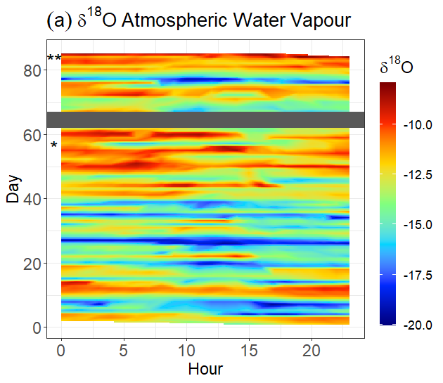
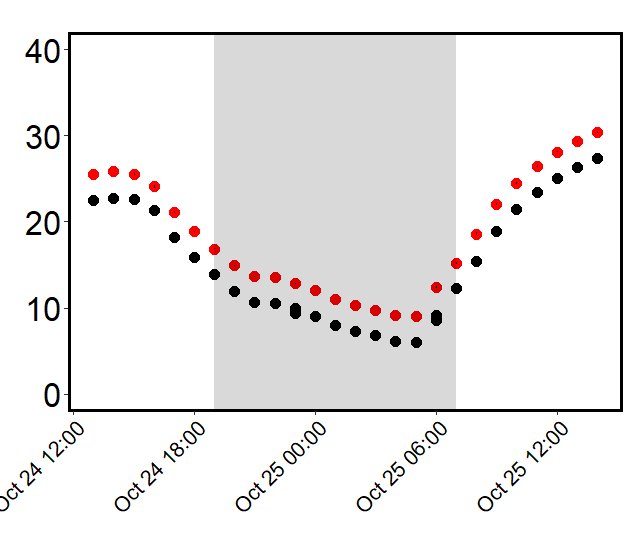

# Whole-Tree-Isoflux
Code to reproduce Whole Tree Isoflux 
The steps to recreate WTC4.

Step 1 Create Figure 2 - This involves exploring temporal data it uses 2 data frames (a water vapour oxygen isotope one (from the LGR) and a gas exchange one from WSU 
(portions of these dataframes are later macthed with wind and rain data to run stats)  

Each Panel of Figure 2 is created individually - but the process is more or less the same:  
#Load Packages  
require(lubridate);require(ggplot2);require(xts);require(dplyr);require(grid);require(cowplot);require(reshape2)  
require(plantecophys);require(akima);require(fields);require(tripack);require(autoimage)# Load Packages  
#Load Data  
googledriveWTC4ISOTOPEID <- "1RNzYApcCO1D1sr_mVQgQVSQFIWNWlqVm"  
df<- read.csv(sprintf("https://docs.google.com/uc?id=%s&export=download", googledriveWTC4ISOTOPEID)) #  
###Set data as time and assign set differnt simmaries e.g months weeks weeks and hour days etc:  
df["Td"]<-(dmy_hm(df$stime, quiet=TRUE, tz="UTC"));summary(df$Td)  
df$date <- as.Date(df$Td, format = "%Y-%m-%d") ; summary(df$date); str(df$date)  
df["month"]<-format(df$Td,"%m");str(df$month)  
df$hm <- format(df$Td, "%H") ; summary(df$hm)  
df["week"]<-strftime(df$Td,format="%W",tz="UTC");str(df$week)  
########################Extract flux data relevant to isotope  
start<-ymd_hms("2016-08-28 12:00:00 UTC");summary(start)  
end<-ymd_hms("2016-11-26 12:00:00")  
int<-interval(start, end); summary(int)  
df<-subset(df, df$Td %within% int);head(df$Td);tail(df$Td)  
##Filter out unrealisitic values  
df<-subset(df, df$d18O.corrected <= -8)  
df<-subset(df, df$d18O.corrected >= -20)  
#Make a managable data frame and get trt means  
dftrt<-data.frame(df$hm, df$month, df$d18O.corrected, df$T_treatment, df$Td);str(dftrt)  
dft<-dftrt %>% group_by(df.T_treatment, df.Td) %>% summarise_at(.vars = names(.)[3:3], na.rm=TRUE, .funs = c(mean))  
##decide if looking at atm , hot or ambinet by un hashing   
#dft<-subset(dft,df.T_treatment == "ambient")  
#dft<-subset(dft,df.T_treatment == "elevated")  
dft<-subset(dft,df.T_treatment == "atm")  

#Rereun time setting (this could improbed no need to do twice really)  
dft$date <- as.Date(dft$df.Td, format = "%Y-%m-%d")   
dft["month"]<-format(dft$df.Td,"%m");str(dft$month);summary(dft$month)  
dft["monthday"]<-format(dft$df.Td,"%m%d");str(dft$monthday);summary(dft$monthday)  
dft<-transform(dft,day=as.numeric(factor(monthday))) #day  
dft<-as.data.frame(dft)  
dft$hm <- format(dft$df.Td, "%H") ; summary(dft$hm)  

##to make the heat map we need a dataframe with 3 vairables: 1) hour 2) day 3) a value (here it is d180atm)  
dfsml<-data.frame(dft$hm, dft$day, dft$df.d18O.corrected)  
#the exammple I followed used xyz so I changed my data frames names and we need to make some STR changes  
colnames(dfsml)<-c("x", "y","z") ; str(dfsml)  
dfsml$x<-as.numeric(paste(dfsml$x))  
dfsml$y<-as.numeric(paste(dfsml$y));str(dfsml)  
x<-as.numeric(paste(dfsml$x))  
y<-as.numeric(paste(dfsml$y))  
z<-dfsml$z  

##We need then need to interpert the data:  

sample=as.data.frame(cbind(x,y,z))  
names(sample) <- c("d", "m", "value")  
d1 <- with(sample, interp(x = d, y = m, z = value, nx = 250, ny=250, duplicate = "mean", extrap=FALSE))  
d2 <- melt(d1$z, na.rm = TRUE)  
names(d2) <- c("x", "y", "z")  

d2$d<- d1$x[d2$x]  
d2$m <- d1$y[d2$y]  

#When plotting I use this colour map -   
jet.colors <- colorRampPalette(c("#00007F", "blue", "#007FFF", "cyan", "#7FFF7F", "yellow", "#FF7F00", "red", "#7F0000"))  

Then in ggplot we can make the graph   
a<-ggplot(data = d2, aes(x = d, y = m, fill = z, z = z)) +   
  geom_tile()+    
  #scale_fill_viridis()+  
  #+ scale_colour_gradient2()  
  scale_fill_gradientn(colours = jet.colors(7), limits =c(-20,-8))+  
  labs(x="Hour", y="Day")+  
  labs(fill=bquote(delta^18*O))+  
  ggtitle((a)~delta^18*O~Atmospheric~Water~Vapour)+  
  theme_bw()+  
  theme(text = element_text(size=17))+  
  theme(axis.text=element_text(size=17))+   
  theme(legend.position='right') +  
  scale_y_continuous(breaks = scales::pretty_breaks(n = 5))+  
  scale_x_continuous(breaks = scales::pretty_breaks(n = 5))+  
  annotate("rect", xmin = -Inf, xmax = Inf, ymin = 62, ymax = 67, alpha = 1)+  
  theme(plot.title = element_text(size = 13.5, face = "bold"))+  
  annotation_custom(textGrob("*", gp = gpar(col = "black", fontsize=20)),   
                    xmin=-0.15, xmax=-1,ymin=55.5, ymax=56.5) +  
  annotation_custom(textGrob("**", gp = gpar(col = "black", fontsize=20)),   
                    xmin=-0.15, xmax=-1,ymin=82.5, ymax=83.5)   +  
  guides(fill=guide_colourbar(barwdith=0.5, barheight =18, nbin=100)) +  
  theme(plot.title = element_text(size = 20, face = "bold"))  
  
  Here is the output:

This is done for all other panels (d18, temp and VPD, scripts in project) 

The next step is plotting the diurnal data from the intensive campaigns.  
FIgures 3,4 and s4 depend on the WTC Transpiration model being run: 

googledriveWTC4ISOTOPEIDCAMPAIGNDATA <- "d/10Y5-KjrbqeSaG6b_c6N7dJFGMsXSYqyq" 
df<- read.csv(sprintf("https://docs.google.com/uc?id=%s&export=download", googledriveWTC4ISOTOPEIDCAMPAIGNDATA)) 
setwd("E:/From M.2/WTC4 Data/Dew") 
df<-read.csv(file="CDFWTC4.csv",header=TRUE, sep=",") #Campaign Data Frame WTC4 
###### 
df["source"]=-3.28 ##from branch water 
### 
R<-287.05 
Rv<-461.95 
Pr<-101.3 
finr<-0.082058 
##diurnal d18ocond 
##Create Time class (I use Td == Time Date), I also create week and hour etc to explore data 
df["Td"]<-(dmy_hm(df$Td, quiet=TRUE, tz="UTC"));str(df$Td) 
df["hour"]<-format(df$Td,"%H");str(df$hour) 
df["month"]<-format(df$Td,"%m");str(df$month) 
df["md"]<-format(df$Td,"%m%d");str(df$md) 
df["week"]<-strftime(df$Td,format="%W",tz="UTC") 

##These equations are a combo of the WTC4 MS, John Drakes GBC Biology and Craigs orginal WTC4 Agmet paper 
####Pref### 
df["Pref"]=((df$AIRPRESS_mean*1000)-df$Vwat_mean)/(R*(df$Tair_al_mean+273))+((df$Vwat_mean)/(Rv*df$Vwat_mean+273)) 
####Fin#### 
df["fin"]=(df$kfactor_mean*(sqrt(df$DIFFP_mean*(1.2/df$Pref)))*(273/(df$Tair_al_mean+273))*(df$AIRPRESS_mean/Pr)) 
###Finmol### 
df["finmol"]=((df$AIRPRESS_mean*0.00986923267)*df$fin)/(finr*(df$Tair_al_mean+273)) 
##fout### 
df["fout"]=df$fin*(((df$AIRPRESS_mean)-df$Href_mean)/((df$Tair_al_mean)-df$Href_mean)) 
##fout mol 
df["foutmol"]=((df$AIRPRESS_mean*0.00986923267)*df$fout)/(finr*(df$Tair_al_mean+273)) 
#uoutwout 
df["uoutwout"]=df$foutmol*df$Vwat_mean 
#uinwin 
df["uinwin"]=df$finmol*df$Fwat_mean 
#condout 
df["condout"]=df$CONDH2O_mean 
##E 
df["E"]=df$uoutwout-df$uinwin+df$condout 
##E-wo 
df["e-wo"]=df$E-df$Vwat_mean 
##d18out 
df["d18out"]=df$d18O.corrected_WV*df$uoutwout 
#d18in 
df["d18in"]=df$d18O.corrected_WV.AMB.*df$uinwin 
##d18c 
df["d18c"]=df$d18O.corrected_Cond*df$condout 
##over e-wo 
df["d18oute"]=df$d18out/df$`e-wo` ;df["d18ine"]=df$d18in/df$`e-wo`; df["d18Ce"]=df$d18c/df$E 
##d trans 
df["dtrans"]=df$d18oute-df$d18ine+df$d18Ce ; mean(df$dtrans, na.rm = TRUE ) ;df$dtrans # this is d18oatm 

We need to express on a leaf area basis  

df$leafarea[df$chamber=="C01"]<-23.62101328 #M^2 
df$leafarea[df$chamber=="C02"]<- 17.17025483 
df$leafarea[df$chamber=="C03"]<- 12.37672299 
df$leafarea[df$chamber=="C04"]<-24.62392584 
df$leafarea[df$chamber=="C05"]<- 12.92316481 
df$leafarea[df$chamber=="C06"]<-29.71035506 
df$leafarea[df$chamber=="C07"]<- 14.61233375 
df$leafarea[df$chamber=="C08"]<- 24.42841037 
df$leafarea[df$chamber=="C09"]<- 17.33770004 
df$leafarea[df$chamber=="C10"]<- 17.13905693 
df$leafarea[df$chamber=="C11"]<- 9.63132978 
df$leafarea[df$chamber=="C12"]<- 27.27409398 
df$LACM<-df$leafarea / 10000 

#wi is the leaf intercellular vapour concentration (mol water vapour/mol moist air) 
#using Licor eqn  mole fraction of water vapor within the leaf, mmol H2O mol air-1. 
df["Ei"]<-6.13753*exp(df$leaftemp*((18.564-(df$leaftemp/254.4)))/(df$leaftemp+255.57)) 
df$wi<-df$Ei / df$AIRPRESS_mean/10  #mol mol -1 
##make E a flux relative to tree lef area 
df$Emmol<-df$E*1000 #go to mmol 
df$Eleaf<-df$Emmol/df$leafarea ; plot(df$Eleaf) #(mmol H2O m-2 s-1) 

##Calculate VPD - good to use the plant ecophys package here  
df$esat<-esat(TdegC=df$Tair_al_mean, Pa = 101) 
df$vpd<-RHtoVPD(RH=df$RH_al_mean, TdegC=df$Tair_al_mean, Pa = 101) ; plot(df$vpd);summary(df$vpd) #the vapour pressure deficit of the chamber airspace (kPa) 

##Calculate gt -gt is total conductance to water vapour through the stomata and leaf boundary layer 
df$gs<-df$Eleaf/df$vpd/10 # mol 

##Calculate Leaf Water Residence Times## 
df$W<- 12 #mol m-2 
df$t<-df$W/(df$gs*df$wi) # in seconds 
df$tm<-df$t/60 ;mean(df$tm, na.rm=TRUE);min(df$tm, na.rm=TRUE);max(df$tm, na.rm=TRUE) # T in mins 
df$th<-df$t/3600 ;mean(df$th, na.rm=TRUE);min(df$th, na.rm=TRUE);max(df$th, na.rm=TRUE) # T in hour 
###Calculate for isotopes 
df$ek=0.027 
df$alphak<-1+df$ek 
df["Eplus"]<-2.644-(3.206*((10^3)/(df$Tair_al_mean+273.16)))+(1.534*((10^6)/((df$Tair_al_mean+273.16)^2))) 
df$betaplus<-(df$Eplus/1000)+ 1 
mean(df$alphak*df$betaplus) 
df$p<-1.2 ##See SI from MS 
##df$alphak*df$betaplus shold be around 1.040 (Table 1 Grahams and Lucas paper) 
df$tiso<-(df$W*df$alphak*df$betaplus)/(df$p*df$gs*df$wi) 
df$tmiso<-df$tiso/60 ;mean(df$tmiso, na.rm=TRUE);min(df$tmiso, na.rm=TRUE);max(df$tmiso, na.rm=TRUE) # T in mins 
df$thiso<-df$tiso/3600 ;mean(df$thiso, na.rm=TRUE);min(df$thiso, na.rm=TRUE);max(df$thiso, na.rm=TRUE) 

###calculate number obsertavtions of dtrans within 2 mil 
df$range<-ifelse(df$dtrans  >= -5.28 & df$dtrans <= -1.28, "within", "not");df$range<-as.factor(df$range) 
summary(df$range) # 107 not in 264 within = 367 total % witin 2 % is 258 /367 
264/(264+107) 

##The following script defines when chamber air temp and chamber dew point temp are within 1C or negative 
#We need to figure out if Dew Point deltas could be influecing gs and make a new colum which says if points are within 
df$dpdiffwtc<-df$Tair_al-df$DewPntC;df$dpdiffwtc 
df$rangewtc<-ifelse(df$dpdiffwtc  >= -1000000 & df$dpdiffwtc<= 1, "not", "within");df$rangewtc<-as.factor(df$rangewtc) 
summary(df$rangewtc) # 80 not in 520 within  

#Count how many data points are comprimised from each treatment 
sub<- df[df$trt == "ambient",] ;summary(sub$rangewtc) # 80 outisde out of 220 ambineto observatins or 36 %  
subx<- df[df$trt == "elevated ",] ;summary(subx$rangewtc) # 0  

#We add a filter to define if it is day time or not and make data frames accoringly 
df$sun<- ifelse(df$PAR >=0.01, "day", "night") 
dfsun<-filter(df, df$sun == "day") 
dfnight<-filter(df, df$sun == "night") 

from here we get the daytime means  
summaryBy(.~trt+Camp,FUN=c(mean,sd),keep.names=T,data=dfsunmean,na.rm=TRUE);max(dfsun$dtrans,na.rm=TRUE) 
and finnaly i create a new dataframe to go and graph 

dfa<-df ##I make dfa to use in the code which makes Figures 2,3 and 4- These scripts will cal for WTC4 Ispflux model to be run 

if the above model is run and we have dfa in the global environment we can make all neccasry panels: 
For example here is the temperture code: 

wtc<-dfa 
Cw<-wtc 
Cw<-subset(Cw, Camp== 1) 
colnames(Cw) 
Cw <- Cw[,c("rangewtc","Tdh","chamber","trt","Tair_al_mean")] 
Trtmean<- summaryBy(.~Tdh+trt+rangewtc,FUN=c(mean),keep.names=T,data=Cw) 
#Trtmean<-filter(Trtmean, !grepl('<NA>', trt ));str(Trtmean) 
se <- function(x) sqrt(var(x)/length(x)) 
Trtsd<- summaryBy(.~Tdh+trt+rangewtc,FUN=c(se),keep.names=T,data=Cw) 
data<-cbind(Trtmean,Trtsd);data<-as.data.frame(data) 

data['Time']<-(dmy_hm(data$Tdh, quiet=TRUE, tz="UTC"));str(data) 

####################### 
Cwx<-wtc 
Cwx<-subset(Cwx, Camp== 3) 
Cwx <- Cwx[,c("rangewtc","Tdh","chamber","trt","Tair_al_mean")] 
Trtmeanx<- summaryBy(.~Tdh+trt+rangewtc,FUN=c(mean),keep.names=T,data=Cwx) 
#Trtmeanx<-filter(Trtmeanx, !grepl('<NA>', trt ))  
se <- function(x) sqrt(var(x)/length(x))  
Trtsdx<- summaryBy(.~Tdh+trt+rangewtc,FUN=c(se),keep.names=T,data=Cwx)  
data2<-cbind(Trtmeanx,Trtsdx);data2<-as.data.frame(data2) 

data2['Time']<-(dmy_hm(data2$Tdh, quiet=TRUE, tz="UTC"));str(data) 

start = as.POSIXct('2016-10-24 19:00:00"', tz="UTC")  
end = as.POSIXct('2016-10-25 07:00:00', tz="UTC") 

start2 = as.POSIXct('2016-11-20 19:00:00"', tz="UTC")  
end2 = as.POSIXct('2016-11-21 07:00:00', tz="UTC") 

str(rects) 
str(data$Time) 

t1<-ggplot(data=data, aes(x=Time, y=Tair_al_mean))+ 
  geom_point(aes(colour=trt, shape=trt), size=3.5,)+  
  annotate("rect", fill = "black", alpha = 0.15,  
           xmin = end, xmax = start, 
           ymin = -Inf, ymax = Inf)+ 
  
  scale_color_manual(name="Legend:",labels = c("Transpired Ambient Chamber", "Transpired Elevated Chamber"),values = c("black", "red"))+ 
  scale_shape_manual(name="Legend:",labels = c("in", "out" ),values = c(16,16))+ 
  geom_errorbar(aes(ymin=Tair_al_mean-Tair_al_mean.1, ymax=Tair_al_mean+Tair_al_mean.1), width=.2, 
                position=position_dodge(.9))+ 
  labs(y="", x = "",element_text(size = 6))+ 
  theme_classic()+theme(panel.border = element_rect(fill = "NA", colour = "black", size = 2))+ 
  ggtitle("")+ theme(legend.position = "none")+ 
  scale_y_continuous ( breaks=scales::pretty_breaks(n=5), 
                       limits = c(0, 40))+ 
  theme(axis.text.y = element_text( color="black", size=25))+ 
  theme(axis.text.x = element_text( color="black", size=16, angle=45, hjust=1 , vjust=1)) 

t3<-ggplot(data=data2, aes(x=Time, y=Tair_al_mean))+ 
  geom_point(aes(colour=trt, shape=rangewtc), size=3.5,)+  
  annotate("rect", fill = "black", alpha = 0.15,  
           xmin = end2, xmax = start2, 
           ymin = -Inf, ymax = Inf)+ 
  
  scale_color_manual(name="Legend:",labels = c("Transpired Ambient Chamber", "Transpired Elevated Chamber"),values = c("black", "red"))+ 
  scale_shape_manual(name="Legend:",labels = c("in", "out" ),values = c(16,16))+ 
  geom_errorbar(aes(ymin=Tair_al_mean-Tair_al_mean.1, ymax=Tair_al_mean+Tair_al_mean.1), width=.2, 
                position=position_dodge(.9))+ 
  labs(y="", x = "",element_text(size = 6))+ 

  theme_classic()+theme(panel.border = element_rect(fill = "NA", colour = "black", size = 2))+ 
  ggtitle("")+ theme(legend.position = "none")+ 
  scale_y_continuous ( breaks=scales::pretty_breaks(n=5), 
                       limits = c(0, 40))+ 
  theme(axis.text.y = element_text( color="black", size=25))+ 
  theme(axis.text.x = element_text( color="black", size=16, angle=45, hjust=1 , vjust=1)) 
  
  here is t1 (which stands for temp - campiagn 1)
  
  each varible (temp , gs , Eleaf etc has its own script and then they are merged using cowplot::plot_grid)  
  figure s4 is slightly different in that it uses facet wrap on the chambers to produce the plots. 

